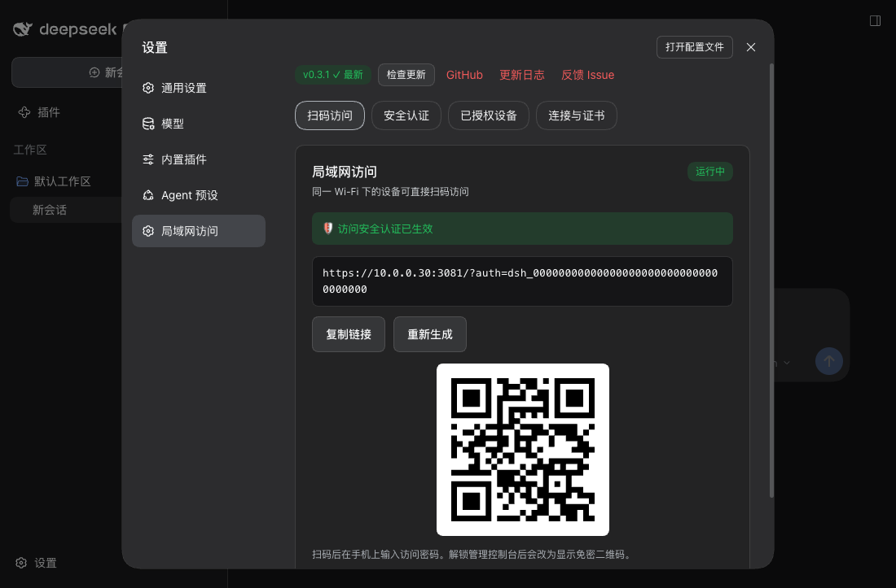
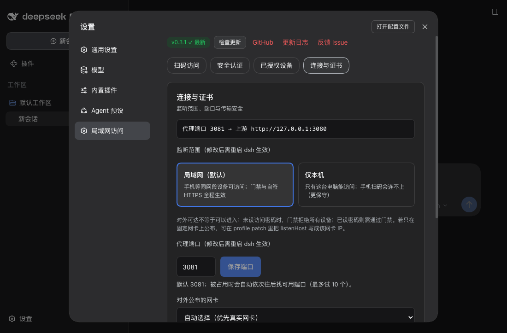
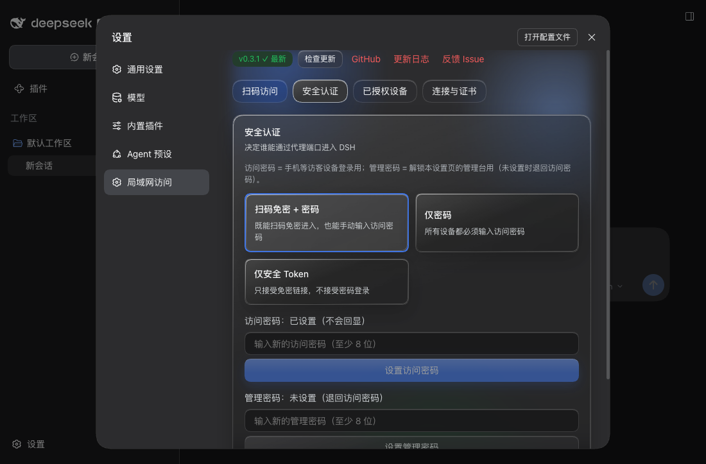
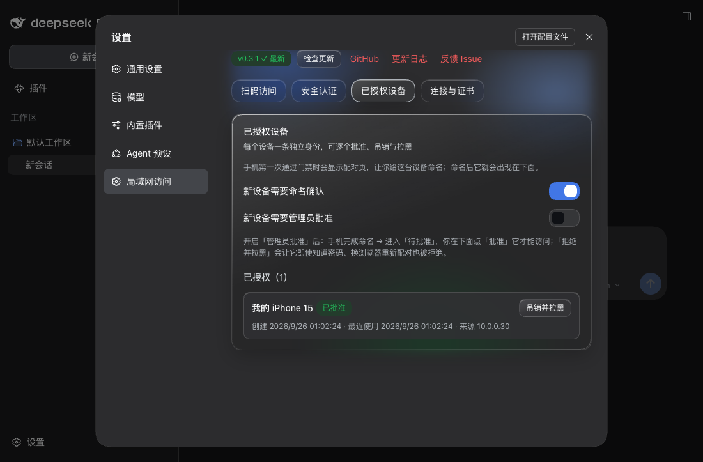
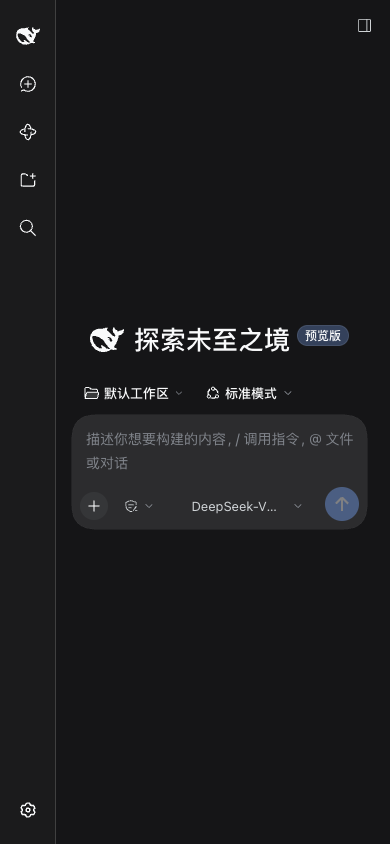

<h1 align="center">DSH LAN Guard</h1>

<p align="center">Expose the desktop DSH Web UI to your LAN safely: a gated reverse proxy with self-signed HTTPS by default and a QR code to open it on a phone. DSH's own loopback binding and the official UI stay untouched.</p>

<p align="center">
  <a href="https://github.com/idoall/dsh-lan-guard/actions/workflows/ci.yml"></a>
  <a href="https://www.npmjs.com/package/dsh-lan-guard"></a>
  <a href="LICENSE"></a>
  
</p>

<p align="center">English | <a href="README.zh.md">中文</a></p>

<p align="center">
  <a href="#what-it-does">What it does</a> ·
  <a href="#quick-start">Quick start</a> ·
  <a href="#settings">Settings</a> ·
  <a href="#compatibility">Compatibility</a> ·
  <a href="#security-boundary">Security boundary</a> ·
  <a href="#troubleshooting">Troubleshooting</a> ·
  <a href="CHANGELOG.md">Changelog</a>
</p>

> DSH LAN Guard is a DeepSeek Harness community plugin. It registers one section in the official settings page (`settings.section`), replaces no official layout, and modifies neither DSH source nor DSH's own listen binding.

DSH serves its Web UI on `127.0.0.1` only, and it deliberately refuses to bind `0.0.0.0`. This plugin leaves that binding alone and opens a **second, gated** listener on another port, proxying the official UI outward as-is: a password gate, self-signed HTTPS by default, a QR code to open it on a phone, and device pairing you can approve or block one by one. **One restart after install is all it takes** — no hand-written configuration.

<p align="center">
  
</p>

## What it does

- **Gated reverse proxy** — relays HTTP and WebSocket end to end (including the official UI's `/api/remote.mux` long connection), rewrites `Host`/`Origin`, strips hop-by-hop headers, and answers `502` when the upstream is down. DSH's own binding and configuration are never touched.
- **LAN-ready by default, but reachable is not the same as enterable** — it binds `0.0.0.0`, so **one restart** after install is enough. The gate is on by default and **refuses every device until you set an access password**, and TLS is self-signed by default — nothing travels in clear. Switch to "this machine only" in the settings page if you prefer.
- **Two passwords** — PBKDF2-SHA256 (600,000 iterations). The **access password** logs visitor devices in; the **admin password** unlocks this settings page's management console (it falls back to the access password). Plus a `dsh_` passwordless link, persistent visitor sessions, per-IP lockout and CSRF checks.
- **Self-signed HTTPS by default, with a stable CA** — generates a `DSH LAN Guard CA` and signs a leaf certificate for the current NIC addresses. Changing IP only re-signs the leaf, so each device trusts the CA once.
- **Your own machine is never locked** — direct `127.0.0.1` access is physically unlocked (whoever can use this computer could change these settings anyway). Remote access follows `adminPolicy`: read-only (default), password-unlocked, or open.
- **Device pairing and permanent blocking** — a phone names itself once when it first passes the gate, receives an HttpOnly device-identity cookie, and appears under **已授权设备** (name / created / last used / source IP) where you can **revoke and block** it. Blocking does not rely on device fingerprinting: re-pairing with the access password from another browser is refused too, and unblocking is the only way back.
- **Settings inside the official page** — the "局域网访问" section has four tabs: QR access, authentication, authorised devices, and connection & certificates. All typography and colours use the official design tokens; **no official layout is replaced**.
- **Configurable port and listen scope** — defaults to `3081` (DSH's port + 1) and walks up to ten ports when that one is taken, with an availability check in the settings page. The listen scope toggles between "LAN (default)" and "this machine only"; both need a DSH restart.
- **Optional mDNS** — off by default; advertises `_dsh-lan-guard._tcp` when enabled.
- **Update check** — the settings page shows "current version → latest on npm" with a copyable upgrade command. The plugin **never installs or restarts anything itself**.

## Quick start

Requirements:

- DeepSeek Harness with a Web profile
- Node.js 20 or newer
- Verified DeepSeek Harness: `0.1.7-rc.2`

Install from npm:

```sh
dsh plugin --profile web add dsh-lan-guard@latest
```

Install from GitHub:

```sh
dsh plugin --profile web add "github:idoall/dsh-lan-guard"
```

Install from a local clone:

```sh
git clone https://github.com/idoall/dsh-lan-guard.git
cd dsh-lan-guard
pnpm install && pnpm run build
dsh plugin --profile web add "link:$(pwd)"
```

Then **restart DSH once** and open **Settings → 局域网访问**. After that restart the plugin is already listening on the LAN (default `0.0.0.0:3081`, self-signed HTTPS + gate); all you do is:

1. Set an **access password** (at least 8 characters) under **安全认证**. Until you do, the gate refuses every device.
2. Check the **listen scope** under **连接与证书** (LAN by default) and pick the NIC to publish on — the NIC decides which IP the QR code / access URL uses and which addresses the self-signed certificate covers.
3. Scan the QR under **扫码访问**, trust `DSH LAN Guard CA` once on the phone, enter the access password, and name the device. The phone then runs the official DSH UI.

> Remote devices are **read-only** by default (`adminPolicy: local_only`): they can use DSH but cannot change plugin settings. Switch the policy on the desktop if you want a phone to manage them.

## Settings

Everything lives under **Settings → 局域网访问**, in four tabs. The non-sensitive switches (`enabled`, `listenPort`, `listenHost`, `networkInterface`, `settingsUnlock`, `auth.mode`, `auth.adminPolicy`, `auth.adminProtection`, `auth.allowLoopback`, `auth.requirePairing`, `auth.requireApproval`) are editable directly; `listenPort` and `listenHost` take effect on the next DSH restart; `settingsUnlock` takes effect on the next page load; `dataDir` and `tls.*` are startup fields that need a profile-patch edit.

| Setting | Default | Effect |
| --- | --- | --- |
| Listen scope | **LAN `0.0.0.0`** | Whether the LAN can reach the port. "This machine only `127.0.0.1`" is more conservative; needs a DSH restart. Both choices keep the gate and self-signed HTTPS in force. |
| Proxy port | **3081** | DSH's port + 1; walks up to ten ports when taken, with an availability check. Needs a DSH restart. |
| NIC to publish on | automatic | Decides which IP the QR code / access URL uses and which addresses the certificate covers; virtual NICs are de-prioritised and labelled. |
| Auth mode | **passwordless QR + password** | Also "password only" or "secure token only". Switching **revokes every existing visitor session**. |
| Access password | unset | The login password for visitor devices. **While unset, the gate refuses every device.** |
| Admin password | unset | Unlocks this settings page's management console; falls back to the access password. |
| Loopback exempt | **on** | Direct `127.0.0.1` access skips the gate (physically unlocked). |
| Official settings page on the LAN | **on** | DSH opens its official settings surface only to loopback pages, so a LAN device opening **Settings → Models** reports `settings are unavailable in this browser`. With this on, any device that passes the gate (phones included) can use those pages after a page refresh. It is a UI unlock, not a new privilege: the settings RPC is gated by the visitor gate either way, and DSH still redacts secret reads. Refresh the page to apply; no restart needed. |
| Require naming | **on** | A new device must name itself once before it appears in the device list. |
| Require approval | off | When on, a named device still needs your **批准** before it is let in. |
| TLS | **self-signed HTTPS** | Turning it off sends the gate password in clear; a non-loopback bind with TLS off is **refused at startup** unless you set `tls.allowInsecureLan: true`. |

<p align="center">
  
</p>

The plugin reads its config from its Cordis entry. **Every key has a usable default, so a fresh install works as-is:**

```yaml
# ~/.dsh/profiles/web/cordis.patch.yml (optional: write only what you want to change)
- id: dsh-lan-guard
  config:
    listenHost: 0.0.0.0              # LAN-facing by default; '127.0.0.1' = this machine only, or one NIC IP
    listenPort: 3081                 # DSH port + 1; auto-walks up to 10 ports when taken
    networkInterface: en0            # optional: publish on one NIC (empty = automatic)
    settingsUnlock: true             # LAN devices may use the official settings page (default on)
    dataDir: ~/.dsh/profiles/web/data/dsh-lan-guard   # optional; this is the derived default
    tls:
      mode: self-signed              # 'self-signed' (default) | 'provided' | 'off'
      allowInsecureLan: false        # required acknowledgement for LAN plain HTTP
    mdns:
      enabled: false                 # advertise _dsh-lan-guard._tcp
    auth:
      mode: token_and_password       # 'token_and_password' | 'password' | 'token'
      adminPolicy: local_only        # 'local_only' (default) | 'password_unlock' | 'open'
      adminProtection: true          # admin console needs the admin password
      allowLoopback: true            # 127.0.0.1 visitors skip the gate (physically unlocked)
      requirePairing: true           # new remote devices must name themselves once
```

`dataDir` is the only key that needs explaining: **omit it** and the plugin uses `<active profile>/data/dsh-lan-guard` (e.g. `~/.dsh/profiles/web/data/dsh-lan-guard`); **set it** and your value wins (a leading `~` is expanded). It only decides where the plugin's private state (password hashes, device-token hashes, sessions, self-signed CA) lives — never whether the plugin works.

<p align="center">
  
</p>

<p align="center">
  
</p>

## Compatibility

Current version: plugin **`0.3.5`**; connection-level visibility and gate-recovery fixes (verified on DeepSeek Harness **`0.1.7-rc.2`**).

| Plugin | Verified DeepSeek Harness | What this version is |
| --- | --- | --- |
| **`0.3.5`** | **`0.1.7-rc.2`**, `0.1.7-rc.1` | Connection-level visibility: an `http://` request to the TLS port goes from "blank page + no log" to a 301 onto `https` with a log line; a deleted device record no longer locks that browser out (revoked/blocked still refuse); the removal-page copy follows |
| **`0.3.4`** | **`0.1.7-rc.2`**, `0.1.7-rc.1` | Official settings page on the LAN: a new `settingsUnlock` switch (on by default) that injects the host-surface marker into the index; applies on page refresh; a UI unlock, not a new privilege |
| **`0.3.3`** | **`0.1.7-rc.2`**, `0.1.7-rc.1` | Gate UX fixes: the two first-visit steps are announced up front; an inert-link page can be logged into again; the blocking note now matches real behaviour (no host-facing change) |
| **`0.3.2`** | **`0.1.7-rc.2`**, `0.1.7-rc.1` | Install and go: LAN-facing default + derived `dataDir`; Liquid Glass settings page at official sizes; single-line scrolling access URL |
| **`0.3.1`** | **`0.1.7-rc.2`**, `0.1.7-rc.1` | Verification release for `0.1.7-rc.2`: no code change, only compatibility metadata |
| `0.3.0` | `0.1.7-rc.1` | Device approval and permanent blocking; fixed the blank page when opening a shared `?auth=` link |
| `0.2.0` | `0.1.7-rc.1` | Update check; removed the corner status pill; spacing fixes |
| `0.1.1` | `0.1.7-rc.1` | Documentation release: bilingual user READMEs |
| `0.1.0` | `0.1.7-rc.1` | First release: gated reverse proxy, self-signed HTTPS, device pairing, settings page, QR access |

- Declared range `>=0.1.7-rc.1 <0.2.0` (`dsh.engines.dsh`); DSH versions not listed are **unverified** — verify them yourself before use.
- Host/client interfaces this plugin uses: `webServer.register` / `webServer.tapIndex` (indexTaps), `connection.requestRejection`, `connection.authenticatedUrl`, the additive `settings.section` seat, `@deepseek-ai/schemastery`, and `profileContext` (for deriving the default data directory).
- **Breaking default change (from `0.3.2`)**: `listenHost` now defaults to `0.0.0.0` instead of `127.0.0.1`, so one restart after install is enough; `0.3.1` and earlier default to loopback only. The gate and self-signed TLS defaults are unchanged (with no password the gate still refuses every device). See the [CHANGELOG](CHANGELOG.md).
- **`0.3.5` verification status**: the changes touch only the proxy's connection-level handling and the gate's verdict; no host/client interface changed; the suite is green at **273** specs (+10) and was falsified (reverting a fix fails its specs); the real-DSH install verification follows the release.
- **`0.3.4` verification status**: the change adds one host-side switch, one index injection and a switch on the plugin's own settings page (`webServer.tapIndex` is a declared host interface); the suite is green at **263** specs; the injected script was exercised in a real Chrome over a non-loopback address in three states; the real-DSH install verification follows the release.
- **`0.3.3` verification status**: the changes touch only the plugin's own pages, copy and gate-form availability; no host/client interface changed; the suite is green at **247** specs; the real-DSH install verification follows the release.

The official UI is reused with zero modifications and adapts on a phone viewport:

<p align="center">
  
</p>

## Security boundary

- DSH's own listen address is never changed; the plugin modifies no DSH configuration, session data, or official UI.
- **Gate before listener** — the listener only opens after the gate object is constructed. The LAN-facing default is acceptable precisely because `auth.enabled` defaults to true, **the gate refuses every non-loopback device while no access password is set**, and TLS defaults to self-signed. All three must hold together.
- Secrets (`secrets.json`, `devices.json`, sessions) live in `dataDir` with mode `600`; passwords are stored only as PBKDF2-SHA256 hashes, a device token is returned in plaintext once and only its SHA-256 hash is stored, and **the passwordless-link token is never written to logs**.
- The proxy stamps every forwarded request with an unforgeable source marker so the host can tell "the machine's own operator" from "a visitor through the proxy".
- Loopback access is **physically unlocked by design** — whoever can use this computer could change these settings anyway.
- **The official-settings-page unlock (`settingsUnlock`) is a UI compatibility patch, not a new transport privilege.** A proxied request is already rewritten to a loopback `host`, and DSH's settings RPC is gated only by the visitor gate (reads are redacted by DSH); the switch merely stops the official page from reporting "settings are unavailable in this browser". Turn it off to restore DSH's stock behaviour.
- The access password is **shared**: revoking a device invalidates that device's identity cookie immediately, but the same browser can re-pair with the password. Permanently blocking one machine would need device fingerprinting or per-device tokens, which this project deliberately avoids.
- LAN only: no public tunnels, no IM bots, no port forwarding.
- The plugin **installs, restarts and pushes nothing**: you copy and run the upgrade command yourself.

## Troubleshooting

**The phone says the certificate is not trusted.** The CA is self-signed: install/trust `DSH LAN Guard CA` once per device. Compare the SHA-256 fingerprint shown under **连接与证书** first.

**The phone cannot connect at all.** Confirm both devices are on the same network and that the address matches the QR code, check for a VPN or a "private relay"-style feature intercepting traffic, and make sure the **listen scope** was not switched to "this machine only".

**The settings page says the port is open to the LAN but no access password is set.** That is the expected intermediate state: the port is reachable, but the gate refuses every device and leaks nothing. Set an access password under **安全认证**.

**"Configured port X was taken; switched to Y."** Another program holds the port and the plugin walked forward. Change the port under **连接与证书** (with an availability check) or free it.

**A LAN device opening Settings → Models reports `加载提供商目录失败: settings are unavailable in this browser`.** That is not a plugin failure: DSH decides whether its official settings surface is usable from the **page's own address bar**, and a LAN address is not loopback, so the surface is permanently downgraded. Open **连接与证书 → 局域网设备可用官方设置页** (on by default) and **refresh the page** on that device. If it still fails, confirm the switch actually saved, that the page was reloaded rather than re-tabbed, and that the DSH version is still inside the supported range.

**"This device's access was removed" (403).** The device was revoked or blocked under **已授权设备**. Delete the record to let it pair again (a blocked device needs **解除拉黑** first).

**I forgot the access password.** On the machine that runs DSH, open `http://127.0.0.1:3080` (direct loopback access is physically unlocked) and set a new one. On a headless server, delete `secrets.json` in `dataDir` and set a new password — until then the gate refuses every device.

**Every device needs the password again after I changed it.** That is intentional: changing the access password or switching the auth mode **revokes every existing visitor session**.

**Plain HTTP on the LAN is refused.** A non-loopback `listenHost` with `tls.mode: 'off'` is rejected unless you set `tls.allowInsecureLan: true` — the gate password would otherwise travel in clear text.

## Upgrade

The settings page shows "current version → latest on npm" with a **copyable** upgrade command:

```sh
dsh plugin --profile web add dsh-lan-guard@latest
```

The plugin **installs nothing and restarts nothing** — you run the command and then restart DSH once. The check only queries the public npm registry and caches results for six hours; when it cannot reach the registry it says so in the UI and leaves the gate and proxy untouched.

## Uninstall

```sh
dsh plugin --profile web remove dsh-lan-guard
rm -rf ~/.dsh/profiles/web/data/dsh-lan-guard   # optional: removes secrets, device records and the CA
```

## Development

```sh
pnpm install
pnpm test          # unit + integration tests (includes type checking)
pnpm run build     # bundles lib/index.js and lib/client.js
pnpm run verify    # typecheck + tests + build + pack dry-run
```

The client half registers into the official additive `settings.section` seat; the host half mounts through the package's own `cordis.patch.yml`.

## Release

Releases are tag-driven. Update `package.json`, move the matching CHANGELOG section out of `Unreleased`, write `release-notes/v<version>.md` with both language anchors, then push the release commit and tag:

```sh
git tag v0.3.1
git push origin v0.3.1
```

The release workflow checks that the tag matches the `package.json` version and that the notes carry both anchors, then runs `pnpm run verify`, packs the plugin, publishes through npm trusted publishing (OIDC), and creates a GitHub Release with the tarball attached.

## License

[MIT](LICENSE)
