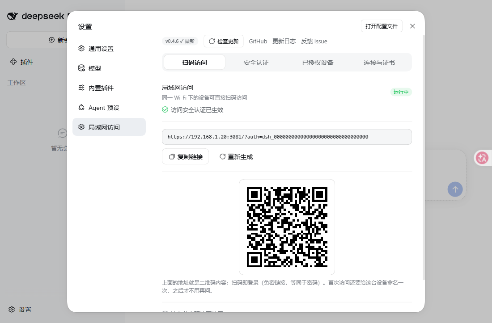
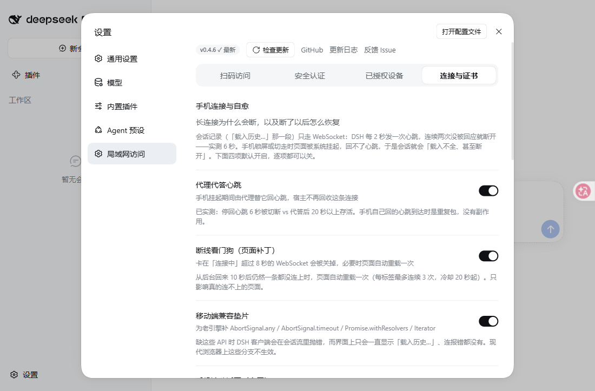
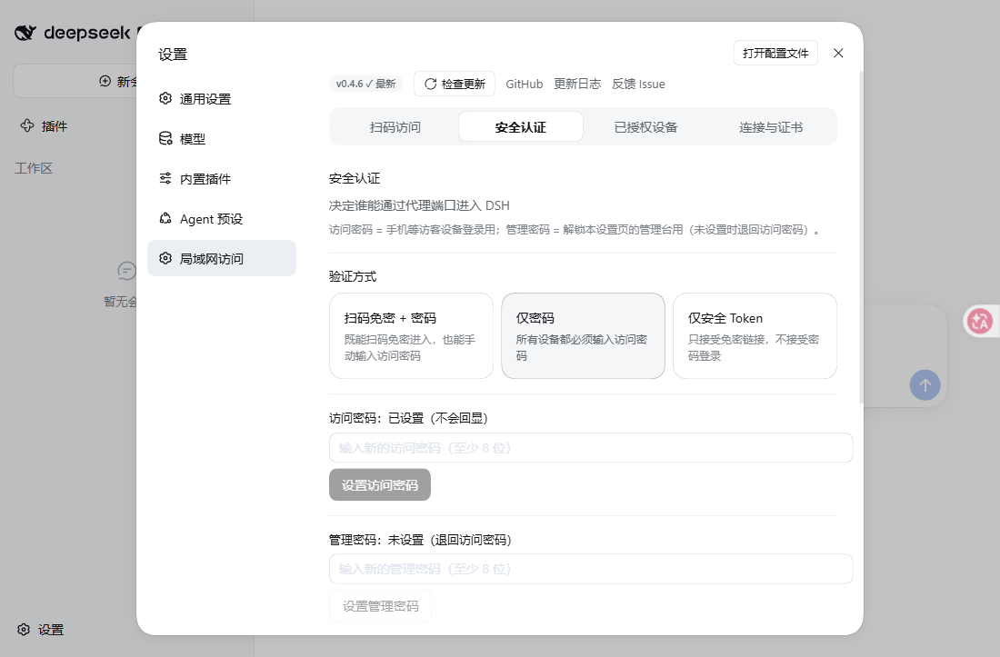
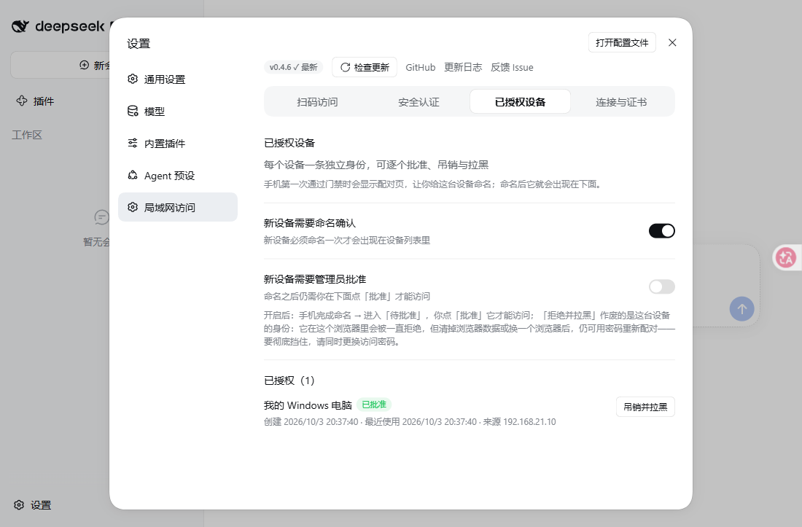
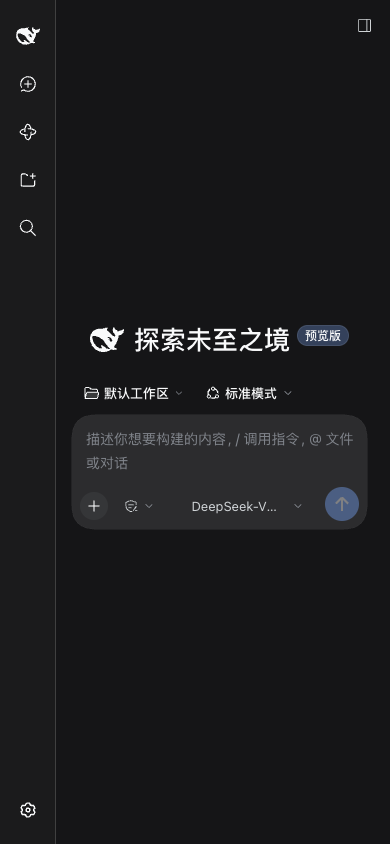

<h1 align="center">DSH LAN Guard</h1>

<p align="center">Expose the desktop DSH Web UI to your LAN safely: a gated reverse proxy with self-signed HTTPS by default and a QR code to open it on a phone. DSH's own loopback binding and the official UI stay untouched.</p>

<p align="center">
  <a href="https://github.com/idoall/dsh-lan-guard/actions/workflows/ci.yml"></a>
  <a href="https://www.npmjs.com/package/dsh-lan-guard"></a>
  <a href="LICENSE"></a>
  
</p>

<p align="center">English | <a href="README.zh.md">中文</a></p>

<p align="center">
  <a href="#what-it-does">What it does</a> ·
  <a href="#quick-start">Quick start</a> ·
  <a href="#settings">Settings</a> ·
  <a href="#compatibility">Compatibility</a> ·
  <a href="#security-boundary">Security boundary</a> ·
  <a href="#troubleshooting">Troubleshooting</a> ·
  <a href="CHANGELOG.md">Changelog</a>
</p>

> DSH LAN Guard is a DeepSeek Harness community plugin. It registers one section in the official settings page (`settings.section`), replaces no official layout, and modifies neither DSH source nor DSH's own listen binding.

DSH serves its Web UI on `127.0.0.1` only, and it deliberately refuses to bind `0.0.0.0`. This plugin leaves that binding alone and opens a **second, gated** listener on another port, proxying the official UI outward as-is: a password gate, self-signed HTTPS by default, a QR code to open it on a phone, and device pairing you can approve or block one by one. **One restart after install is all it takes** — no hand-written configuration.

<p align="center">
  
</p>

## What it does

- **Gated reverse proxy** — relays HTTP and WebSocket end to end (including the official UI's `/api/remote.mux` long connection), rewrites `Host`/`Origin`, strips hop-by-hop headers, and answers `502` when the upstream is down. DSH's own binding and configuration are never touched.
- **LAN-ready by default, but reachable is not the same as enterable** — it binds `0.0.0.0`, so **one restart** after install is enough. The gate is on by default and **refuses every device until you set an access password**, and TLS is self-signed by default — nothing travels in clear. Switch to "this machine only" in the settings page if you prefer.
- **Two passwords** — PBKDF2-SHA256 (600,000 iterations). The **access password** logs visitor devices in; the **admin password** unlocks this settings page's management console (it falls back to the access password). Plus a `dsh_` passwordless link, persistent visitor sessions, per-IP lockout and CSRF checks.
- **Self-signed HTTPS by default, with a stable CA** — generates a `DSH LAN Guard CA` and signs a leaf certificate for the current NIC addresses. Changing IP only re-signs the leaf, so each device trusts the CA once.
- **Your own machine is never locked** — direct `127.0.0.1` access is physically unlocked (whoever can use this computer could change these settings anyway). Remote access follows `adminPolicy`: read-only (default), password-unlocked, or open.
- **Device pairing and permanent blocking** — a phone names itself once when it first passes the gate, receives an HttpOnly device-identity cookie, and appears under **已授权设备** (name / created / last used / source IP) where you can **revoke and block** it. Blocking does not rely on device fingerprinting: re-pairing with the access password from another browser is refused too, and unblocking is the only way back.
- **Settings inside the official page** — the "局域网访问" section has four tabs: QR access, authentication, authorised devices, and connection & certificates. All typography and colours use the official design tokens; **no official layout is replaced**.
- **Adding a workspace from a phone (smart routing)** — DSH resolves its directory picker once at boot, and a loopback bind with a display resolves to `native`: tapping "添加工作区" on a phone actually opens the folder dialog **on the host's screen**. This plugin shadows the official pick flow from the browser half at a lower slot priority, so **the local browser keeps the OS dialog while a remote device gets an in-page directory browser** (breadcrumbs, shortcuts, directory list). The chosen path still goes through DSH's own workspace flow — this plugin only reads directories, never writes anything.
- **Configurable port and listen scope** — defaults to `3081` (DSH's port + 1) and walks up to ten ports when that one is taken, with an availability check in the settings page. The listen scope toggles between "LAN (default)" and "this machine only"; both need a DSH restart.
- **Optional mDNS** — off by default; advertises `_dsh-lan-guard._tcp` when enabled.
- **Update check** — the settings page shows "current version → latest on npm" with a copyable upgrade command. The plugin **never installs or restarts anything itself**.

## Quick start

Requirements:

- DeepSeek Harness with a Web profile
- Node.js 20 or newer
- Verified DeepSeek Harness: `0.2.1-alpha.1`

Install from npm:

```sh
dsh plugin --profile web add dsh-lan-guard@latest
```

Install from GitHub:

```sh
dsh plugin --profile web add "github:idoall/dsh-lan-guard"
```

Install from a local clone:

```sh
git clone https://github.com/idoall/dsh-lan-guard.git
cd dsh-lan-guard
pnpm install && pnpm run build
dsh plugin --profile web add "link:$(pwd)"
```

Then **restart DSH once** and open **Settings → 局域网访问**. After that restart the plugin is already listening on the LAN (default `0.0.0.0:3081`, self-signed HTTPS + gate); all you do is:

1. Set an **access password** (at least 8 characters) under **安全认证**. Until you do, the gate refuses every device.
2. Check the **listen scope** under **连接与证书** (LAN by default) and pick the NIC to publish on — the NIC decides which IP the QR code / access URL uses and which addresses the self-signed certificate covers.
3. Scan the QR under **扫码访问**, trust `DSH LAN Guard CA` once on the phone, enter the access password, and name the device. The phone then runs the official DSH UI.

> Remote devices are **read-only** by default (`adminPolicy: local_only`): they can use DSH but cannot change plugin settings. Switch the policy on the desktop if you want a phone to manage them.

## Settings

Everything lives under **Settings → 局域网访问**, in four tabs. The non-sensitive switches (`enabled`, `listenPort`, `listenHost`, `networkInterface`, `settingsUnlock`, `answerHeartbeat`, `socketWatchdog`, `mobileCompat`, `mobileScrollFix`, `mobileTurnRail`, `auth.mode`, `auth.adminPolicy`, `auth.adminProtection`, `auth.allowLoopback`, `auth.requirePairing`, `auth.requireApproval`) are editable directly; `listenPort` and `listenHost` take effect on the next DSH restart; `settingsUnlock`, `socketWatchdog`, `mobileCompat`, `mobileScrollFix` and `mobileTurnRail` take effect on the next page load while `answerHeartbeat` also applies to connections that are already open; `dataDir` and `tls.*` are startup fields that need a profile-patch edit.

| Setting | Default | Effect |
| --- | --- | --- |
| Listen scope | **LAN `0.0.0.0`** | Whether the LAN can reach the port. "This machine only `127.0.0.1`" is more conservative; needs a DSH restart. Both choices keep the gate and self-signed HTTPS in force. |
| Proxy port | **3081** | DSH's port + 1; walks up to ten ports when taken, with an availability check. Needs a DSH restart. |
| NIC to publish on | automatic | Decides which IP the QR code / access URL uses and which addresses the certificate covers; virtual NICs are de-prioritised and labelled. |
| Auth mode | **passwordless QR + password** | Also "password only" or "secure token only". Switching **revokes every existing visitor session**. |
| Access password | unset | The login password for visitor devices. **While unset, the gate refuses every device.** |
| Admin password | unset | Unlocks this settings page's management console; falls back to the access password. |
| Loopback exempt | **on** | Direct `127.0.0.1` access skips the gate (physically unlocked). |
| Remote management rights | **this machine only** | Whether LAN devices may manage: "this machine only" is read-only; "password unlock" needs an unlock first; "not locked" adds no requirement. **Browsing directories and adding a workspace remotely needs one of the latter two.** |
| Management needs an unlock | **on** | Turned off, a remote session that satisfies the policy may change settings directly — except under "this machine only", which never allows remote management. |
| Official settings page on the LAN | **on** | DSH opens its official settings surface only to loopback pages, so a LAN device opening **Settings → Models** reports `settings are unavailable in this browser`. With this on, any device that passes the gate (phones included) can use those pages after a page refresh. It is a UI unlock, not a new privilege: the settings RPC is gated by the visitor gate either way, and DSH still redacts secret reads. Refresh the page to apply; no restart needed. |
| Answer the host heartbeat | **on** | DSH pings every WebSocket every 2 s and drops it after two unanswered pings (measured: 6 s). A suspended phone cannot answer, and the **session transcript** — the only part of the UI that rides that socket — then loads incompletely or disconnects. With this on the proxy answers instead; the phone's own Pong, when it arrives, is a harmless duplicate. Applies immediately, including to open connections. |
| Socket watchdog | **on** | Page patch: a WebSocket still in CONNECTING after 8 s is closed, and a page resumed with nothing open reloads itself once (at most three in a row per tab, backing off from 20 s). Only a page that genuinely cannot connect is affected. Applies on page refresh. |
| Mobile compatibility shims | **on** | Page patch: fills in `AbortSignal.any`/`AbortSignal.timeout`/`Promise.withResolvers`/`Iterator` and the mobile metas. Without those APIs DSH's client throws inside its session-stream path and the UI just sits on 「载入历史…」 with no error at all. On a modern engine every branch is a no-op. Applies on page refresh. |
| Narrow-screen scroll fix | **on** | DSH's own shell clips the conversation column on a phone (`pI_x6G_frame`, measured 844/1688) and the page cannot scroll, so content is visible but cannot be dragged. The patch only acts when narrow screen + mobile UA + page cannot scroll + a clipping overflowing layer exists; healthy pages are untouched. `?lgdiag=1` prints a layout report. Applies on page refresh. |
| Require naming | **on** | A new device must name itself once before it appears in the device list. |
| Require approval | off | When on, a named device still needs your **批准** before it is let in. |
| TLS | **self-signed HTTPS** | Turning it off sends the gate password in clear; a non-loopback bind with TLS off is **refused at startup** unless you set `tls.allowInsecureLan: true`. |

<p align="center">
  
</p>

The plugin reads its config from its Cordis entry. **Every key has a usable default, so a fresh install works as-is:**

```yaml
# ~/.dsh/profiles/web/cordis.patch.yml (optional: write only what you want to change)
- id: dsh-lan-guard
  config:
    listenHost: 0.0.0.0              # LAN-facing by default; '127.0.0.1' = this machine only, or one NIC IP
    listenPort: 3081                 # DSH port + 1; auto-walks up to 10 ports when taken
    networkInterface: en0            # optional: publish on one NIC (empty = automatic)
    settingsUnlock: true             # LAN devices may use the official settings page (default on)
    answerHeartbeat: true            # proxy answers the WebSocket heartbeat (default on)
    socketWatchdog: true             # page-side socket watchdog (default on)
    mobileCompat: true               # mobile compatibility shims (default on)
    mobileTurnRail: false            # show DSH's own turn rail on narrow screens (default off)
    dataDir: ~/.dsh/profiles/web/data/dsh-lan-guard   # optional; this is the derived default
    tls:
      mode: self-signed              # 'self-signed' (default) | 'provided' | 'off'
      allowInsecureLan: false        # required acknowledgement for LAN plain HTTP
    mdns:
      enabled: false                 # advertise _dsh-lan-guard._tcp
    auth:
      mode: token_and_password       # 'token_and_password' | 'password' | 'token'
      adminPolicy: local_only        # 'local_only' (default) | 'password_unlock' | 'open'
      adminProtection: true          # admin console needs the admin password
      allowLoopback: true            # 127.0.0.1 visitors skip the gate (physically unlocked)
      requirePairing: true           # new remote devices must name themselves once
```

`dataDir` is the only key that needs explaining: **omit it** and the plugin uses `<active profile>/data/dsh-lan-guard` (e.g. `~/.dsh/profiles/web/data/dsh-lan-guard`); **set it** and your value wins (a leading `~` is expanded). It only decides where the plugin's private state (password hashes, device-token hashes, sessions, self-signed CA) lives — never whether the plugin works.

<p align="center">
  
</p>

<p align="center">
  
</p>

## Compatibility

Current version: plugin **`0.5.0`**; compatible with DeepSeek Harness **`0.2.1-alpha.1`** (the adaptation itself is declaration-only and touches no code; this release also adds one off-by-default switch, `mobileTurnRail`).

| Plugin | Verified DeepSeek Harness | What this version is |
| --- | --- | --- |
| **`0.5.0`** | **`0.2.1-alpha.1`**, **`0.2.0-rc.2`**, `0.2.0-rc.1`, `0.1.7-rc.2` | (1) **Adaptation, zero code**: across the 266 commits from `rc.2` to `0.2.1-alpha.1`, of the six surfaces this plugin depends on only `ui-layout` (new `shell.bottom` slot, frame grid rows → `minmax(0,1fr) auto`) and `ui-renderer` (drops the unreferenced `invariant.ts`) changed source, and neither concerns this plugin (nothing renders `shell.bottom` — measured at 0 height). devDependencies raised to `dsh-host-webserver`/`dsh-client-connection` `0.2.1-alpha.1`, **and — because the new host packages peer-require the vendor prereleases — `@deepseek-ai/cordis` to `4.0.5-alpha.1` and `@deepseek-ai/schemastery` to `3.18.5-alpha.1`** (a `^4.0.4` range excludes prereleases); type check + 368 tests green. (2) **New `mobileTurnRail` (off by default)**: un-hides DSH's own turn rail, which the official narrow-screen container query hides. (3) Narrow-screen regression re-run: right sidebar 100% visible, 0 clipped layers, healthy scroll range, zero compensation engagement — identical on 3080 and 3081 |
| **`0.4.6`** | **`0.2.0-rc.2`**, **`0.2.0-rc.1`**, `0.1.7-rc.2` | Verification release for `0.2.0-rc.2`: zero code changes, compatibility metadata only (`dsh.compatibility.dshReleases` gains `0.2.0-rc.2`), plus both host devDependencies raised to `0.2.0-rc.2` and the type check and full suite re-run. Upstream changed only version numbers between `rc.1` and `rc.2` (the sole source edit is a hooks-ordering fix in `ui-renderer`, unrelated to this plugin), so the plugin runs on `rc.2` unchanged; measurements also confirm the mobile clip compensation now has nothing to act on (clipped layers 1 → **0**, scroll range 336px → **92343px**; every polling round reverts wholesale and writes no inline style) |
| **`0.4.5`** | **`0.2.0-rc.1`**, `0.1.7-rc.2` | Long transcripts hydrate after the official scroller has already picked up a small scroll range; the mobile clip compensation treated that intermediate state as healthy and stopped, so a late `overflow:hidden` layer was never released (measured on device: 336px of scroll range with 1 clipped layer inside the scroller). It now keeps looking inside the existing polling window and releases the late layer — 336px → 6889px, 1 clipped layer → 0, official "back to bottom" still on screen |
| **`0.4.4`** | **`0.2.0-rc.1`**, `0.1.7-rc.2` | iOS session scrolling on DSH `0.2.0-rc.1`: an inner `overflow:hidden` layer with a locked height clipped the conversation (measured on device: 21083px of content behind a 336px scroll range), so a session did not open at the newest message and barely dragged. `mobileScrollFix` now grows that inner layer and drops its scroll-container role, restoring 20675px — verified on device with the composer still pinned and the official "back to bottom" button back in place |
| **`0.4.3`** | **`0.2.0-rc.1`**, `0.1.7-rc.2`, `0.1.7-rc.1` | Direction change: fix the mobile **height chain** instead of patching `overflow` — a definite height for `html/body/#root`, `100dvh` on the shell and `min-height:0` along the clipping chain, self-checked and reverted wholesale when the official scroll layer still does not scroll; removes the self-made "back to bottom" button and every `overflow-y`/`-webkit-overflow-scrolling` patch; declares DSH `0.2.0-rc.1` and widens the `dsh`/peer ranges to `<0.3.0` |
| **`0.4.2`** | `0.1.7-rc.2` | The official "back to bottom" button restored: the narrow-screen correction left the conversation's own scroll layer without a growing height, so the official button never believed it was away from the end — the plugin supplies one while hidden and yields as soon as the official one works; also reverts its `overflow-y` patch whenever a full-screen mask or dialog opens (the drawer-scrim regression) |
| **`0.4.1`** | `0.1.7-rc.2` | First cut of `mobileScrollFix` for "the chat area cannot be dragged on a phone": applies touch-scrollable treatment only when narrow viewport + mobile UA + the page cannot scroll + a clipped overflowing layer is found, and never touches an already-scrolling page; adds the `?lgdiag=1` layout report; measured on device, 86.4s of connection survival with heartbeat answering |
| **`0.4.0`** | **`0.1.7-rc.2`**, `0.1.7-rc.1` | Mobile long-connection self-healing: the proxy answers DSH's WebSocket heartbeat (measured: 6 s reap without it, 20 s+ survival with it); page patches adding a socket watchdog and mobile compatibility shims; a connection health check and relay counters on the "connection" tab |
| **`0.3.6`** | **`0.1.7-rc.2`**, `0.1.7-rc.1` | Adding a workspace from a remote device: the browser half shadows the official directory flow (the local browser keeps the OS dialog, a remote device gets an in-page browser and can unlock inside it); fixes the proxy dropping the plugin's admin cookie in both directions, which made `password_unlock` meaningless remotely; adds the missing "remote management rights" control; moves the "saved" confirmation to a top-right notification; reworks status-surface colours against measured contrast; fixes the picker's crushed breadcrumb/shortcut rows |
| **`0.3.5`** | **`0.1.7-rc.2`**, `0.1.7-rc.1` | Connection-level visibility: an `http://` request to the TLS port goes from "blank page + no log" to a 301 onto `https` with a log line; a deleted device record no longer locks that browser out (revoked/blocked still refuse); the removal-page copy follows |
| **`0.3.4`** | **`0.1.7-rc.2`**, `0.1.7-rc.1` | Official settings page on the LAN: a new `settingsUnlock` switch (on by default) that injects the host-surface marker into the index; applies on page refresh; a UI unlock, not a new privilege |
| **`0.3.3`** | **`0.1.7-rc.2`**, `0.1.7-rc.1` | Gate UX fixes: the two first-visit steps are announced up front; an inert-link page can be logged into again; the blocking note now matches real behaviour (no host-facing change) |
| **`0.3.2`** | **`0.1.7-rc.2`**, `0.1.7-rc.1` | Install and go: LAN-facing default + derived `dataDir`; Liquid Glass settings page at official sizes; single-line scrolling access URL |
| **`0.3.1`** | **`0.1.7-rc.2`**, `0.1.7-rc.1` | Verification release for `0.1.7-rc.2`: no code change, only compatibility metadata |
| `0.3.0` | `0.1.7-rc.1` | Device approval and permanent blocking; fixed the blank page when opening a shared `?auth=` link |
| `0.2.0` | `0.1.7-rc.1` | Update check; removed the corner status pill; spacing fixes |
| `0.1.1` | `0.1.7-rc.1` | Documentation release: bilingual user READMEs |
| `0.1.0` | `0.1.7-rc.1` | First release: gated reverse proxy, self-signed HTTPS, device pairing, settings page, QR access |

- Declared range `>=0.1.7-rc.1 <0.3.0` (`dsh.engines.dsh`); verified releases: `0.1.7-rc.1`, `0.1.7-rc.2`, `0.2.0-rc.1`, `0.2.0-rc.2`, `0.2.1-alpha.1`. DSH versions not listed are **unverified** — verify them yourself before use. The upper bound was widened from `<0.2.0` in `0.4.3` because profile load refuses a bundle whose range excludes the running release, and a plain `<0.2.0` would exclude the `0.2.0` stable.
- Host/client interfaces this plugin uses: `webServer.register` / `webServer.tapIndex` (indexTaps), `connection.requestRejection`, `connection.authenticatedUrl`, the additive `settings.section` seat, `@deepseek-ai/schemastery`, and `profileContext` (for deriving the default data directory).
- **Breaking default change (from `0.3.2`)**: `listenHost` now defaults to `0.0.0.0` instead of `127.0.0.1`, so one restart after install is enough; `0.3.1` and earlier default to loopback only. The gate and self-signed TLS defaults are unchanged (with no password the gate still refuses every device). See the [CHANGELOG](CHANGELOG.md).
- **`0.4.0` verification status**: all three changes carry measurements, not just specs.
  1. **Proxy answers the heartbeat**: a Node client against the **real DSH** measured a **6.0 s** reap after it stopped sending Pongs (`close 1006`, no Close frame); with the answerer on the same link **survived 20 s** (10 pings answered). An end-to-end spec reproduces the pair against a DSH-shaped upstream (40 ms pings, destroy after two misses): **reaps without the answerer, survives with it**.
  2. **Page patches**: the injected scripts are **executed** in the suite against a fake environment and clock — "a socket stuck in CONNECTING is closed after 8 s", "never reloads while one socket is OPEN", "never reloads a page that created no socket", "reloads once after a resume with nothing open, then backs off within the cooldown and cap", "never reloads while hidden".
  3. **Browser verification** (BrowserSkill, Chrome 154, through a temporary loopback forward that still traverses the whole plugin path): `/api/remote.mux` handshake 3 ms; the `session/follow` snapshot arrives in 43–110 ms as a single 2.1 MB frame; 310 frames over 12 s with no interruption; and with the page's main thread frozen for 12 s a connection without the answerer received `close 1006`.
  The suite is green at **349** specs (330 in 0.3.6). The real-DSH install verification follows the release (this machine runs the installed 0.3.6, so the code takes effect after a reinstall plus a DSH restart).

### Why a phone's session socket dies (measured 2026-09-28)

The session transcript — the 「载入历史…」 part of the UI — **rides the WebSocket only**; the session list, the goal chip and the statistics arrive over HTTP, which is why the failure looks like "everything is there except the conversation". Three facts define it:

| Fact | Source |
| --- | --- |
| The host pings every 2 s and drops a socket after two unanswered pings | `websocketHeartbeatIntervalMs: 2000`, `MAX_MISSED_HEARTBEATS: 2` |
| A client that stops sending Pongs is dropped after **6.0 s** (`close 1006`, no Close frame) | measured three ways: direct on 3081, through a forward, and with a frozen browser main thread |
| A phone that switches away or locks its screen cannot answer | iOS suspends the page; WebKit additionally has a case where `new WebSocket()` stays in CONNECTING forever after a resume while HTTP keeps working |

Three layers ship in this release, all on by default and each individually switchable:

1. **`answerHeartbeat`** — while relaying, the proxy reads the upstream→browser control frames and answers a Ping with a masked Pong on the client's behalf. RFC 6455 allows an unsolicited Pong and the host only resets its counter on "a Pong arrived", so the phone's own duplicate is harmless. This is the only layer that stops the host from reaping a suspended phone.
2. **`socketWatchdog`** — the page-side half: close a socket that is stuck in CONNECTING, and reload once when a resume leaves nothing open.
3. **`mobileCompat`** — `AbortSignal.any`/`timeout`, `Promise.withResolvers`, `Iterator` and the mobile metas. DSH's client calls `AbortSignal.any` on its session-stream path, and `Session.doOpen` re-throws non-transport errors, so a missing API shows up as a permanent 「载入历史…」 with no error text.

**Settings → 局域网访问 → 连接与证书 → 手机连接与自愈** carries a connection health check: it inspects which APIs this browser lacks, which patches the page received, runs a real WebSocket handshake against the current origin, and shows the proxy-side counters (open connections, upgrades, refusals, answered heartbeats) plus the last connection's duration, bytes and whether it died abnormally.

- **`0.3.6` verification status**: the change spans the host side (a new directory-listing route and cookie relaying) and the client side (the directory browser, the settings controls, the notification and the colour rework). The suite is green at **330** specs (+57); all three commits were verified in isolation in their own worktrees (278 / 304 / 330 each passing); it was falsified (reverting the cookie relay, the no-shrink rule, or the hover-tint surface each fails its specs); and contrast was computed from DSH's real token values, 10/10 passing in light and dark. The real-DSH install verification follows the release.
- **`0.3.5` verification status**: the changes touch only the proxy's connection-level handling and the gate's verdict; no host/client interface changed; the suite is green at **273** specs (+10) and was falsified (reverting a fix fails its specs); the real-DSH install verification follows the release.
- **`0.3.4` verification status**: the change adds one host-side switch, one index injection and a switch on the plugin's own settings page (`webServer.tapIndex` is a declared host interface); the suite is green at **263** specs; the injected script was exercised in a real Chrome over a non-loopback address in three states; the real-DSH install verification follows the release.
- **`0.3.3` verification status**: the changes touch only the plugin's own pages, copy and gate-form availability; no host/client interface changed; the suite is green at **247** specs; the real-DSH install verification follows the release.

The official UI is reused with zero modifications and adapts on a phone viewport:

<p align="center">
  
</p>

### Why a phone "cannot see all messages" / cannot scroll (measured 2026-09-28)

**Symptom**: on a phone the newest content is partly visible but the column cannot be dragged, while the fixed goal / quick-reply / composer floats cover the text.

**Root cause (measured on the device viewport)**: on narrow screens DSH's own shell keeps the conversation in `pI_x6G_frame` with `overflow:hidden` while the content is taller — measured `clientHeight=844 / scrollHeight=1688` — and the page as a whole cannot scroll either (`pageScrolls=false`). The content is clipped, so it is visible but not draggable. The same viewport scrolls fine in desktop Chrome, so this is an iOS/narrow-screen layout difference, **not the reverse proxy** (all DOM/CSS comes from the official shell and the installed plugins).

**Fix (`mobileScrollFix`, on by default)**: the injected script only acts when narrow screen AND mobile UA AND the page cannot scroll AND it actually finds a layer clipping overflowing content; it then makes exactly those layers touch-scrollable (`overflow-y:auto`, `-webkit-overflow-scrolling:touch`, `touch-action:pan-y`). Healthy pages are never touched.

**"Back to bottom" button (from 0.4.2)**: on narrow screens the official button shows only when not at the tail, judged against the scroll layer the official code believes in — which is not the layer that actually scrolls, so it never appears. The gateway therefore ships an equivalent floating button (shown whenever the view is not at the bottom, smooth-scrolls on click, yields to the official button once that appears, and positions itself above the composer).

**Self-check**: append `?lgdiag=1` to the page URL for an on-screen report (`narrow / mobile / innerHeight / visualViewport / pageScrolls / clippingLayers / patched`). That report is exactly the data that located this bug.

### Bringing the PC turn rail to the phone (`mobileTurnRail`, off by default, added 2026-10-06)

**It is already there — it is just hidden.** The rail that floats at the right of a session on the desktop (grey ticks = loaded turns, dim ticks = not loaded yet, black bar = the current turn; hovering previews; tapping an unloaded turn pages the history in first) is **rendered and wired up on a phone too**. `ChatView` mounts it unconditionally; the only thing hiding it is DSH's own container query:
`@container (max-width: 900px) { .frame { display: none } }` (the container is the chat frame, only about 327px wide on a 390px phone).

**What this switch does**: a stylesheet scoped to `≤1023px` un-hides that rail and moves it out of the message column into the chat frame's right gutter (`right:2px`, 24px wide).
**Why not reimplement it**: the turn data (`ui-chat`'s `navigation.items()`) is package-internal, so a plugin cannot rebuild the rail — but it does not need to. Un-hiding **reuses** the official component: its jump-to-turn, its page-history-in, its active-turn follow and its previews. This plugin adds no scroll container, no button and no listener of its own.

**Measured (0.2.1-alpha.1 / 390×844, with the injected script run verbatim)**: `display:none` → `block`, rect `[357,355,24,52]`, 5 marks, 10px pitch, exactly one `aria-current`; the message column ends at x=351 and the rail starts at x=357, so it **no longer covers the text**; the `Global panels` and `Session hierarchy` navs are untouched; zero page errors.

**Known limit (hence off by default)**: each mark is only 24×10px, and the pitch is fixed at 10px inside DSH's own JavaScript — CSS-growing them to 44px would make neighbours overlap and mis-tap. It is good for "see where you are and jump", not for "tap precisely with a thumb". If on-device testing shows the hit area is the real problem, the right follow-up is a transparent touch layer (pick a turn from the finger's vertical position), not bigger CSS.

**Self-check and revert**: after installing, the script confirms the rail is really visible. If upstream ever strengthens its hide (higher specificity), the script **removes the injected stylesheet wholesale** within about 3 seconds, leaving the page byte-identical to stock, and records `"reverted"` in `__DSH_LAN_GUARD__.mobileTurnRail` (surfaced as `轮次导航 ✗ 已回退` in the connection doctor). `?lgdiag=1` adds a `[lan-guard 轮次导航诊断]` panel at the bottom of the screen.

## Security boundary

- DSH's own listen address is never changed; the plugin modifies no DSH configuration, session data, or official UI.
- **Gate before listener** — the listener only opens after the gate object is constructed. The LAN-facing default is acceptable precisely because `auth.enabled` defaults to true, **the gate refuses every non-loopback device while no access password is set**, and TLS defaults to self-signed. All three must hold together.
- Secrets (`secrets.json`, `devices.json`, sessions) live in `dataDir` with mode `600`; passwords are stored only as PBKDF2-SHA256 hashes, a device token is returned in plaintext once and only its SHA-256 hash is stored, and **the passwordless-link token is never written to logs**.
- The proxy stamps every forwarded request with an unforgeable source marker so the host can tell "the machine's own operator" from "a visitor through the proxy".
- Loopback access is **physically unlocked by design** — whoever can use this computer could change these settings anyway.
- **The official-settings-page unlock (`settingsUnlock`) is a UI compatibility patch, not a new transport privilege.** A proxied request is already rewritten to a loopback `host`, and DSH's settings RPC is gated only by the visitor gate (reads are redacted by DSH); the switch merely stops the official page from reporting "settings are unavailable in this browser". Turn it off to restore DSH's stock behaviour.
- The access password is **shared**: revoking a device invalidates that device's identity cookie immediately, but the same browser can re-pair with the password. Permanently blocking one machine would need device fingerprinting or per-device tokens, which this project deliberately avoids.
- **Exactly one cookie is relayed.** The proxy injects DSH's loopback session cookie and never passes an upstream `set-cookie` through — with one exception: this plugin's OWN admin session cookie (`dsh_lan_guard_admin`, HttpOnly, SameSite=Strict, 30 minutes by default). The plugin mints it and the plugin's route validates it, but that route runs on DSH's web server, so without the relay no remote device could ever unlock the console and `password_unlock` would be meaningless. The visitor's gate session and device identity still never reach DSH.
- **The remote directory browser is read-only and carries the management console's authority.** It lists directory names only (credential stores such as `.ssh`/`.aws`/`.env` and system directories are refused, symlinks are re-checked against their real target, one level is capped at 1,000 rows and rate-limited), and it **creates or modifies nothing** — DSH's own workspace flow performs the registration. The route reuses the management authentication: the machine's operator or an unlocked remote session, so under the default `local_only` a remote device gets `read_only_remote`.
- LAN only: no public tunnels, no IM bots, no port forwarding.
- The plugin **installs, restarts and pushes nothing**: you copy and run the upgrade command yourself.

## Troubleshooting

**The phone says the certificate is not trusted.** The CA is self-signed: install/trust `DSH LAN Guard CA` once per device. Compare the SHA-256 fingerprint shown under **连接与证书** first.

**The phone cannot connect at all.** Confirm both devices are on the same network and that the address matches the QR code, check for a VPN or a "private relay"-style feature intercepting traffic, and make sure the **listen scope** was not switched to "this machine only".

**The settings page says the port is open to the LAN but no access password is set.** That is the expected intermediate state: the port is reachable, but the gate refuses every device and leaks nothing. Set an access password under **安全认证**.

**"Configured port X was taken; switched to Y."** Another program holds the port and the plugin walked forward. Change the port under **连接与证书** (with an availability check) or free it.

**A LAN device opening Settings → Models reports `加载提供商目录失败: settings are unavailable in this browser`.** That is not a plugin failure: DSH decides whether its official settings surface is usable from the **page's own address bar**, and a LAN address is not loopback, so the surface is permanently downgraded. Open **连接与证书 → 局域网设备可用官方设置页** (on by default) and **refresh the page** on that device. If it still fails, confirm the switch actually saved, that the page was reloaded rather than re-tabbed, and that the DSH version is still inside the supported range.

**"This device's access was removed" (403).** The device was revoked or blocked under **已授权设备**. Delete the record to let it pair again (a blocked device needs **解除拉黑** first).

**Tapping "添加工作区" remotely does nothing (or the dialog opens on the computer).** That is DSH's directory picker: it resolves once at boot, and a loopback bind with a display resolves to `native`, so the dialog opens **on the host's screen** where a remote device cannot see or reach it. This plugin takes it over with two interactions — the OS dialog locally, an in-page directory browser remotely.

If the sheet reports "**远程设备当前只读**", the policy is still "this machine only": open **设置 → 局域网访问 → 安全认证 → 远程设备管理权限** on the computer and pick "密码解锁" (or "不锁定"), then refresh the page on that device.

If it reports "**需要先解锁管理控制台**", just type the admin password into the sheet and press 解锁 — the list appears immediately, with no trip to the settings page.

**I forgot the access password.** On the machine that runs DSH, open `http://127.0.0.1:3080` (direct loopback access is physically unlocked) and set a new one. On a headless server, delete `secrets.json` in `dataDir` and set a new password — until then the gate refuses every device.

**Every device needs the password again after I changed it.** That is intentional: changing the access password or switching the auth mode **revokes every existing visitor session**.

**Plain HTTP on the LAN is refused.** A non-loopback `listenHost` with `tls.mode: 'off'` is rejected unless you set `tls.allowInsecureLan: true` — the gate password would otherwise travel in clear text.

## Upgrade

The settings page shows "current version → latest on npm" with a **copyable** upgrade command:

```sh
dsh plugin --profile web add dsh-lan-guard@latest
```

The plugin **installs nothing and restarts nothing** — you run the command and then restart DSH once. The check only queries the public npm registry and caches results for six hours; when it cannot reach the registry it says so in the UI and leaves the gate and proxy untouched.

## Uninstall

```sh
dsh plugin --profile web remove dsh-lan-guard
rm -rf ~/.dsh/profiles/web/data/dsh-lan-guard   # optional: removes secrets, device records and the CA
```

## Development

```sh
pnpm install
pnpm test          # unit + integration tests (includes type checking)
pnpm run build     # bundles lib/index.js and lib/client.js
pnpm run verify    # typecheck + tests + build + pack dry-run
```

The client half registers into the official additive `settings.section` seat; the host half mounts through the package's own `cordis.patch.yml`.

### Docs

| Document | What it is for |
| --- | --- |
| [docs/dsh-version-adaptation.md](docs/dsh-version-adaptation.md) | **Follow this when DSH ships a new version**: which packages to diff, which interfaces to check, how to declare and release |
| [docs/mobile-regression.md](docs/mobile-regression.md) | **Narrow-screen geometry regression, runnable on a computer**: two entries, four quantitative criteria (+1 optional turn-rail criterion), token-free direct access to 3080 |
| [docs/mobile-acceptance.md](docs/mobile-acceptance.md) | On-device acceptance checklist (touch, lock screen / backgrounding, dictation — things a computer cannot verify) |
| [docs/mobile-debug-runbook.md](docs/mobile-debug-runbook.md) | Runbook for when the phone misbehaves (incl. Web Inspector probes) |
| [docs/upstream-dsh-0.2.0-rc.1-session-scroll.md](docs/upstream-dsh-0.2.0-rc.1-session-scroll.md) | Draft regression report for upstream (rc.1 transcript clipping) |

## Release

Releases are tag-driven. Update `package.json`, move the matching CHANGELOG section out of `Unreleased`, write `release-notes/v<version>.md` with both language anchors, then push the release commit and tag:

```sh
git tag v0.3.1
git push origin v0.3.1
```

The release workflow checks that the tag matches the `package.json` version and that the notes carry both anchors, then runs `pnpm run verify`, packs the plugin, publishes through npm trusted publishing (OIDC), and creates a GitHub Release with the tarball attached.

## License

[MIT](LICENSE)
